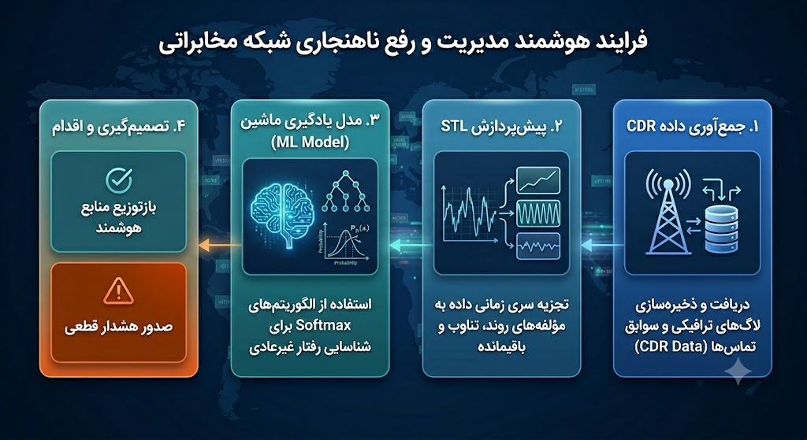
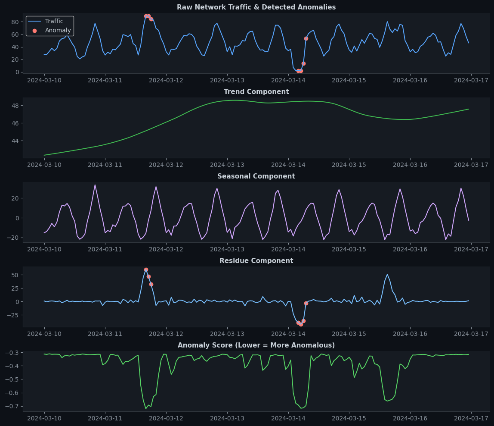

# MCI Network Traffic Analysis & Anomaly Detection

This project was developed for the **MCI Academy** to explore the application of Artificial Intelligence and Big Data in telecommunication network management. The project focuses on identifying traffic patterns and predicting network anomalies/outages.

## 📌 Project Overview
Telecommunication networks generate massive amounts of data. This project leverages machine learning techniques to:
- **Analyze Traffic Patterns:** Modeling high-traffic hours and user behavior.
- **Anomaly Detection:** Implementing unsupervised learning to detect network disruptions.
- **Predictive Maintenance:** Identifying segments of the network susceptible to failure.

## 📊 Visualization Highlights
In this project, we analyzed network traffic patterns and successfully identified anomalies using machine learning. Below are the visual results of our traffic decomposition and anomaly detection:

| Raw Traffic & Anomaly Detection | Seasonal & Trend Analysis |
| :---: | :---: |
|  |  |

*The left chart displays the raw traffic throughput with red markers indicating detected anomalies, while the right chart visualizes the decomposition of traffic into trend and seasonal components.*

## 🛠️ Key Features
- **Data Preprocessing:** Cleaning and structuring massive telecom datasets.
- **Time-Series Decomposition:** Using **STL Decomposition** (Seasonal, Trend, and Residue) to isolate traffic components.
- **Anomaly Detection:** Implementing the **Isolation Forest** algorithm to detect network traffic anomalies.
- **Visualization:** Developing a grid-based visualization dashboard using `Matplotlib` and `GridSpec` to display real-time/historical metrics.

## 📁 Repository Structure
- `/Data`: Contains the dataset (confidential).
- `/Notebooks`: Jupyter notebook containing the full analysis and implementation.
- `/Report`: The final conceptual and analytical report (`HamraheAval_Project.pdf`).
- `/Docs`: Original project instructions and requirements.

## 🚀 Technologies
- **Language:** Python
- **Libraries:** `pandas`, `numpy`, `scikit-learn`, `matplotlib`, `statsmodels` (for decomposition)
- **Algorithms:** Isolation Forest (for anomaly detection)

## 👤 Author
**Vahid Hamzeh**
- Sharif University of Technology
- MCI Academy Project (June 2026)
